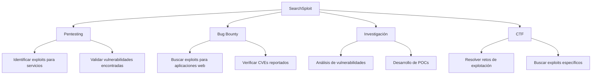
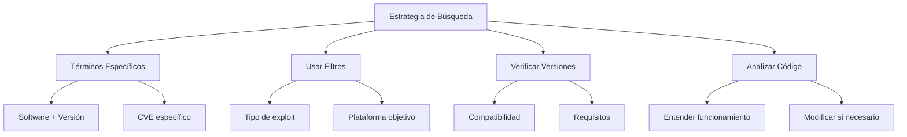

# 🔍 SearchSploit: Búsqueda de Exploits Locales

> [!info] Herramienta esencial de pentesting
> **SearchSploit** es una herramienta de línea de comandos que permite buscar exploits y shellcodes en la base de datos local de Exploit-DB. Es parte de la suite de herramientas de Kali Linux y facilita la búsqueda rápida de vulnerabilidades conocidas sin necesidad de conexión a internet.

---

## 📋 Tabla de Contenidos
- [Introducción](#introducción)
- [Instalación y Configuración](#instalación-y-configuración)
- [Sintaxis Básica](#sintaxis-básica)
- [Parámetros y Opciones](#parámetros-y-opciones)
- [Casos de Uso](#casos-de-uso)
- [Ejemplos Prácticos](#ejemplos-prácticos)
- [Tips y Buenas Prácticas](#tips-y-buenas-prácticas)

---

## 📝 Introducción

### ¿Qué es SearchSploit?

SearchSploit es una herramienta de búsqueda offline para la base de datos de **Exploit-DB**, que contiene miles de exploits, shellcodes y papers relacionados con vulnerabilidades. Permite a los pentesters y investigadores de seguridad encontrar rápidamente exploits relevantes para las vulnerabilidades identificadas en sus objetivos.

### ¿Para qué sirve?

- **Búsqueda rápida de exploits** basada en nombres de software, versiones o CVEs
- **Análisis offline** de vulnerabilidades sin depender de conexión a internet
- **Identificación de vectores de ataque** para servicios y aplicaciones específicas
- **Investigación de seguridad** y desarrollo de pruebas de concepto
- **Preparación de payloads** para testing de penetración

### Contextos de uso en ciberseguridad



> [!note] Base de datos Exploit-DB
> Exploit-DB es mantenido por Offensive Security y contiene más de 50,000 exploits, shellcodes y papers de seguridad. SearchSploit proporciona acceso offline a esta vasta colección.

---

## 💾 Instalación y Configuración

### Instalación en diferentes sistemas

```bash
# En Kali Linux (preinstalado)
searchsploit --version

# En sistemas Debian/Ubuntu
sudo apt update
sudo apt install exploitdb

# Instalación manual desde GitHub
git clone https://github.com/offensive-security/exploitdb.git /opt/exploitdb
ln -sf /opt/exploitdb/searchsploit /usr/local/bin/searchsploit
```

### Actualización de la base de datos

```bash
# Actualizar la base de datos de exploits
searchsploit -u

# Verificar la ubicación de la base de datos
searchsploit -h | grep "Path"
```

---

## 🖥️ Sintaxis Básica

```bash
searchsploit [opciones] término_búsqueda
```

### Formato básico de búsqueda

- **Por nombre de software**: `searchsploit apache`
- **Por versión específica**: `searchsploit "apache 2.4"`
- **Por CVE**: `searchsploit CVE-2021-44228`
- **Por tipo de plataforma**: `searchsploit windows kernel`
- **Búsqueda exacta**: `searchsploit -t apache`

> [!example] Búsqueda básica
> ```bash
> # Buscar exploits para Apache
> searchsploit apache
> 
> # Buscar por CVE específico
> searchsploit CVE-2014-6271
> ```

---

## ⚙️ Parámetros y Opciones

### Opciones de búsqueda

| Opción | Descripción | Ejemplo |
|--------|-------------|---------|
| `-t`, `--title` | Búsqueda solo en títulos | `searchsploit -t "apache 2.4"` |
| `-e`, `--exact` | Búsqueda exacta (evita resultados parciales) | `searchsploit -e wordpress` |
| `-s`, `--strict` | Búsqueda estricta sin coincidencias parciales | `searchsploit -s nginx` |
| `-w`, `--www` | Mostrar URLs de Exploit-DB online | `searchsploit -w apache` |
| `-c`, `--case` | Búsqueda sensible a mayúsculas/minúsculas | `searchsploit -c Apache` |
| `-j`, `--json` | Salida en formato JSON | `searchsploit -j apache` |

### Opciones de filtrado

| Opción | Descripción | Ejemplo |
|--------|-------------|---------|
| `--exclude` | Excluir términos de la búsqueda | `searchsploit apache --exclude="2.2"` |
| `--platform` | Filtrar por plataforma | `searchsploit --platform=linux kernel` |
| `--type` | Filtrar por tipo de exploit | `searchsploit --type=remote apache` |
| `--port` | Filtrar por puerto específico | `searchsploit --port=80 apache` |

### Opciones de salida y gestión

| Opción | Descripción | Ejemplo |
|--------|-------------|---------|
| `-m`, `--mirror` | Copiar exploit al directorio actual | `searchsploit -m 12345` |
| `-x`, `--examine` | Examinar exploit con editor por defecto | `searchsploit -x 12345` |
| `-p`, `--path` | Mostrar ruta completa del archivo | `searchsploit -p apache` |
| `-u`, `--update` | Actualizar base de datos | `searchsploit -u` |
| `-h`, `--help` | Mostrar ayuda | `searchsploit -h` |

---

## 🎯 Casos de Uso

### 1. Enumeración post-reconocimiento

Después de identificar servicios y versiones durante el reconocimiento, SearchSploit ayuda a encontrar exploits específicos para las tecnologías detectadas.

### 2. Validación de vulnerabilidades

Cuando se detectan CVEs específicos, SearchSploit puede proporcionar exploits funcionales para validar la vulnerabilidad.

### 3. Investigación de seguridad

Para investigadores que necesitan analizar vulnerabilidades históricas o desarrollar nuevas técnicas de explotación.

### 4. Preparación de assessment

Antes de realizar pruebas de penetración, buscar exploits conocidos para las tecnologías del objetivo.

---

## 💻 Ejemplos Prácticos

### Ejemplo 1: Búsqueda básica por servicio y versión

```bash
# Buscar exploits para Apache HTTP Server versión 2.4
searchsploit "apache 2.4"

# Buscar exploits para WordPress
searchsploit wordpress

# Búsqueda más específica para WordPress con versión
searchsploit "wordpress 5.8"
```

> [!info] Explicación
> Esta búsqueda básica te ayuda a identificar rápidamente exploits disponibles para servicios específicos. Los resultados muestran:
> - **Exploit ID**: Número único del exploit en la base de datos
> - **Descripción**: Breve descripción de la vulnerabilidad
> - **Fecha**: Cuándo fue publicado el exploit
> - **Autor**: Quien desarrolló el exploit
> - **Plataforma**: Sistema operativo o aplicación afectada
> 
> **Resultado típico:**
> ```
> ------------------------------------------------- ---------------------------------
>  Exploit Title                                   |  Path
> ------------------------------------------------- ---------------------------------
> Apache + PHP < 5.3.12 / < 5.4.2 - cgi-bin Remo | php/remote/29290.c
> Apache 2.4.17 < 2.4.38 - 'apache2ctl graceful'  | linux/local/46676.php
> Apache Tomcat - AJP 'Ghostcat File Read/Inclusi | multiple/webapps/48143.py
> ------------------------------------------------- ---------------------------------
> ```

### Ejemplo 2: Trabajar con exploits específicos

```bash
# Buscar exploit específico por CVE
searchsploit CVE-2021-44228

# Examinar un exploit específico (abre en editor)
searchsploit -x 50592

# Copiar exploit al directorio actual para modificación
searchsploit -m 50592

# Ver la ruta completa donde está almacenado el exploit
searchsploit -p CVE-2021-44228
```

> [!info] Explicación
> Estos comandos te permiten trabajar directamente con exploits específicos:
> 1. **Búsqueda por CVE**: Encuentra exploits relacionados con una vulnerabilidad específica (Log4Shell en este ejemplo)
> 2. **Examinar exploit**: Abre el código del exploit en tu editor por defecto para revisión
> 3. **Copiar exploit**: Descarga una copia local del exploit para modificación o uso
> 4. **Ver ruta**: Muestra dónde está almacenado el archivo original
> 
> El comando `-m` es especialmente útil cuando necesitas modificar un exploit para tu entorno específico.

### Ejemplo 3: Búsqueda avanzada con filtros

```bash
# Buscar solo exploits remotos para Apache
searchsploit apache --type=remote

# Buscar exploits para Linux excluyendo versiones antiguas
searchsploit linux kernel --exclude="2.6"

# Buscar exploits con salida JSON para procesamiento automatizado
searchsploit wordpress --json > wordpress_exploits.json

# Búsqueda estricta para evitar falsos positivos
searchsploit -s "microsoft windows" --platform=windows

# Combinar múltiples filtros
searchsploit apache --type=remote --exclude="1.3" -t
```

> [!info] Explicación
> Los filtros avanzados permiten búsquedas más precisas:
> 1. **Filtro por tipo**: `--type=remote` solo muestra exploits de ejecución remota
> 2. **Exclusión**: `--exclude` elimina resultados no deseados (versiones antiguas)
> 3. **Formato JSON**: Útil para scripts que procesan automáticamente los resultados
> 4. **Búsqueda estricta**: `-s` evita coincidencias parciales no deseadas
> 5. **Filtros combinados**: Puedes usar múltiples opciones para refinar resultados
> 
> Estos filtros son cruciales cuando trabajas con software común que tiene muchos exploits disponibles.

---

## 💡 Tips y Buenas Prácticas

### Optimización de búsquedas



> [!tip] Mejores prácticas
> **Estrategias de búsqueda efectiva:**
> - Usa **términos específicos** con versiones exactas cuando sea posible
> - Aplica **filtros de plataforma** para reducir ruido en los resultados
> - **Examina siempre** el código del exploit antes de usarlo
> - **Mantén actualizada** la base de datos regularmente
> - **Combina con nmap** y otras herramientas de reconocimiento
> - **Documenta** los exploits útiles para futuros assessments

### Flujo de trabajo recomendado

```bash
# 1. Actualizar base de datos
searchsploit -u

# 2. Búsqueda inicial amplia
searchsploit apache

# 3. Refinar con filtros específicos
searchsploit apache 2.4 --type=remote

# 4. Examinar exploits prometedores
searchsploit -x 12345

# 5. Copiar y modificar si es necesario
searchsploit -m 12345
```

### Integración con otras herramientas

```bash
# Integrar con nmap results
nmap -sV target.com | grep "Apache" | while read line; do
    version=$(echo $line | grep -o '[0-9]\+\.[0-9]\+\.[0-9]\+')
    searchsploit "apache $version"
done

# Buscar exploits para servicios identificados
services="apache nginx mysql wordpress"
for service in $services; do
    echo "=== Exploits para $service ==="
    searchsploit $service --type=remote
    echo
done

# Automatizar búsqueda de CVEs
while read cve; do
    echo "Buscando exploits para $cve"
    searchsploit $cve -w
done < cve_list.txt
```

### Errores comunes y soluciones

| Error | Causa | Solución |
|-------|-------|----------|
| No se encuentran resultados | Términos demasiado específicos | Usar búsqueda más amplia sin versión |
| Demasiados resultados | Búsqueda muy general | Añadir filtros específicos |
| Exploit no funciona | Código desactualizado o específico | Examinar código y adaptar al entorno |
| Base de datos desactualizada | No se actualiza regularmente | Ejecutar `searchsploit -u` |
| Formato de salida confuso | Configuración por defecto | Usar opciones de formato como `-j` o `-p` |

### Comandos útiles para analysis

```bash
# Ver estadísticas de la base de datos
find /usr/share/exploitdb -name "*.txt" | wc -l

# Buscar los exploits más recientes
find /usr/share/exploitdb -name "*.py" -newer $(date -d "1 month ago" +%Y-%m-%d) | head -10

# Crear backup de exploits importantes
mkdir ~/important_exploits
searchsploit -m 12345 45678 54321
mv *.py *.c *.rb ~/important_exploits/

# Buscar exploits por autor específico
grep -r "Author.*Metasploit" /usr/share/exploitdb/

# Ver exploits por plataforma
ls /usr/share/exploitdb/exploits/ | sort
```

---

## 📊 Comparación con herramientas similares

| Herramienta | Alcance | Offline | Actualización | Integración |
|-------------|---------|---------|---------------|-------------|
| **SearchSploit** | ⭐⭐⭐⭐⭐ | ✅ | Manual | Excelente |
| **Metasploit Search** | ⭐⭐⭐⭐ | ✅ | Con framework | Nativa |
| **CVE Details** | ⭐⭐⭐ | ❌ | Automática | Web |
| **Vulners** | ⭐⭐⭐⭐ | ❌ | Automática | API |
| **0day.today** | ⭐⭐ | ❌ | Continua | Web |

> [!success] Ventajas de SearchSploit
> - **Acceso offline** completo a la base de datos
> - **Rápido y ligero** para búsquedas frecuentes
> - **Integración sencilla** con scripts y workflows
> - **Base de datos confiable** mantenida por Offensive Security
> - **Formato consistente** y bien estructurado

---

## 🔗 Comandos de referencia rápida

```bash
# Búsquedas básicas
searchsploit apache                    # Búsqueda general
searchsploit "apache 2.4"            # Versión específica
searchsploit CVE-2021-44228          # Por CVE

# Opciones de salida
searchsploit -w apache                # Con URLs web
searchsploit -p apache                # Con rutas de archivos
searchsploit -j apache                # Formato JSON

# Gestión de exploits
searchsploit -m 12345                 # Copiar exploit
searchsploit -x 12345                 # Examinar exploit

# Filtros avanzados
searchsploit apache --type=remote     # Solo remotos
searchsploit linux --exclude="2.6"   # Excluir versiones
searchsploit -t apache                # Solo en títulos

# Mantenimiento
searchsploit -u                       # Actualizar base de datos
```

> [!note] Recurso adicional
> Para obtener más información sobre un exploit específico, siempre puedes visitar la entrada completa en exploit-db.com usando el ID del exploit o la opción `-w` para obtener la URL directa.