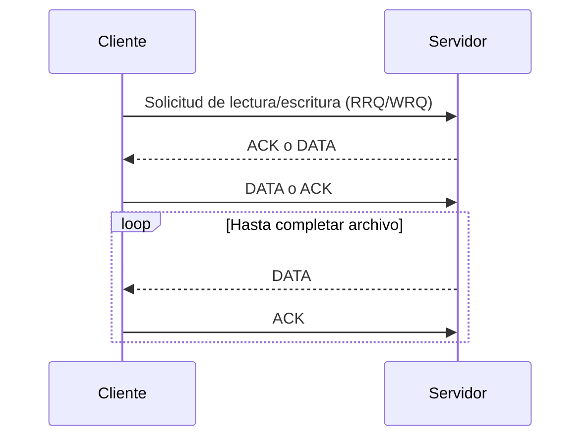
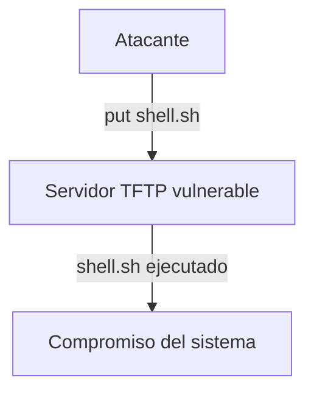

# 📡 Protocolo TFTP (Trivial File Transfer Protocol)

---

## 📝 Introducción

### ¿Qué es TFTP?

**TFTP (Trivial File Transfer Protocol)** es un protocolo de transferencia de archivos extremadamente simple, diseñado para facilitar la transmisión de archivos en redes locales. Opera sobre UDP y es ampliamente utilizado en entornos donde se requiere una transferencia rápida y sin autenticación, como en el arranque de dispositivos de red, routers, switches y sistemas embebidos.

### ¿Para qué sirve?

- Transferencia de archivos de configuración o firmware a dispositivos de red
- Arranque de sistemas sin disco (PXE Boot)
- Copia de archivos en entornos controlados donde la seguridad no es prioritaria

### Contextos de uso en ciberseguridad

- **Post-explotación**: Exfiltración o carga de archivos en sistemas comprometidos
- **Red Team**: Transferencia rápida de payloads en redes internas
- **Análisis forense**: Recuperación de archivos de dispositivos embebidos
- **Auditoría de red**: Detección de servidores TFTP inseguros

---

## ⚙️ Funcionamiento y Sintaxis

### Características principales

| Característica | Detalle |
|----------------|---------|
| **Puerto** | UDP 69 |
| **Transporte** | UDP (no TCP) |
| **Autenticación** | No soportada |
| **Dirección** | No orientado a conexión |
| **Comandos** | GET (lectura), PUT (escritura) |
| **Seguridad** | Nula (sin cifrado, sin autenticación) |

### Flujo básico de TFTP



### Sintaxis básica de comandos

```bash
# Leer (descargar) un archivo desde el servidor TFTP
tftp <ip_servidor> -c get <archivo_remoto> <archivo_local>

# Escribir (subir) un archivo al servidor TFTP
tftp <ip_servidor> -c put <archivo_local> <archivo_remoto>
```

> [!tip] En sistemas modernos, el cliente suele ser `tftp` o `atftp`.

---

## 🛠️ Parámetros y Opciones Comunes

| Opción | Descripción | Ejemplo |
|--------|-------------|---------|
| `-c` | Ejecuta un comando (get/put) | `-c get archivo` |
| `-m` | Especifica el modo (octet, netascii) | `-m octet` |
| `-v` | Modo verbose (detallado) | `-v` |
| `-l` | Especifica archivo local | `-l archivo_local` |
| `-r` | Especifica archivo remoto | `-r archivo_remoto` |

### Modos de transferencia

- **octet**: Binario (recomendado para archivos no texto)
- **netascii**: ASCII (para archivos de texto plano)

---

## 💻 Ejemplos Prácticos

### Ejemplo 1: Descargar un archivo de configuración

```bash
# Descargar archivo config.txt desde un servidor TFTP
tftp 192.168.1.10 -c get config.txt

# O usando atftp
atftp --get --local-file=config.txt --remote-file=config.txt 192.168.1.10
```

### Ejemplo 2: Subir un archivo malicioso (post-explotación)

```bash
# Subir un payload a un servidor TFTP vulnerable
tftp 192.168.1.10 -c put shell.sh

# O con atftp
atftp --put --local-file=shell.sh --remote-file=shell.sh 192.168.1.10
```

### Ejemplo 3: Usar TFTP en scripts de pentesting

```bash
# Script para descargar múltiples archivos
for file in passwd shadow hosts; do
    tftp 192.168.1.10 -c get $file
done
```

---

## ⚠️ Riesgos y Consideraciones de Seguridad

> [!warning] TFTP es INSEGURO por diseño
> - **Sin autenticación**: Cualquiera puede leer o escribir archivos
> - **Sin cifrado**: Todo el tráfico es en texto claro
> - **Sin control de acceso**: Puede ser explotado para exfiltración o carga de malware
> - **Uso limitado recomendado**: Solo en redes internas y controladas

### Ejemplo de ataque



---

## 🛡️ Tips y Buenas Prácticas

> [!tip] Consejos para pentesters y administradores
> - **Buscar servidores TFTP expuestos** en auditorías de red (`nmap -sU -p 69 --script tftp-enum`)
> - **Limitar el acceso** a TFTP solo a hosts autorizados
> - **Deshabilitar TFTP** si no es estrictamente necesario
> - **Monitorear logs** de acceso a TFTP para detectar actividad sospechosa
> - **Usar TFTP solo para archivos no sensibles** y en entornos controlados

### Errores comunes y soluciones

| Error | Causa | Solución |
|-------|-------|----------|
| `Permission denied` | El servidor no permite escritura | Revisar permisos en el servidor |
| `Timeout` | Firewall bloquea UDP 69 | Abrir puerto o probar conectividad |
| `File not found` | Archivo no existe en el servidor | Verificar nombre y ruta |
| `Access violation` | Restricción de acceso en el servidor | Revisar configuración del servidor |

---

## 📊 Comparativa TFTP vs FTP vs SFTP

| Protocolo | Puerto | Transporte | Autenticación | Cifrado | Uso típico |
|-----------|--------|------------|---------------|---------|-----------|
| **TFTP**  | 69/UDP | UDP        | ❌            | ❌      | Boot, config, IoT |
| **FTP**   | 21/TCP | TCP        | ✅            | ❌      | Transferencia general |
| **SFTP**  | 22/TCP | TCP (SSH)  | ✅            | ✅      | Transferencia segura |

---

## 🔍 Detección y Enumeración

### Escaneo con Nmap

```bash
# Detectar servidores TFTP en la red
nmap -sU -p 69 --script tftp-enum 192.168.1.0/24
```

### Enumeración manual

```bash
# Listar archivos conocidos (si el servidor lo permite)
tftp 192.168.1.10 -c get /etc/passwd
tftp 192.168.1.10 -c get /etc/shadow
```

---

## 🧠 Resumen

- **TFTP** es un protocolo de transferencia de archivos simple y rápido, pero **muy inseguro**.
- Es útil en redes internas, arranque PXE y dispositivos embebidos, pero **no debe usarse en redes públicas**.
- Es un vector común de exfiltración y persistencia en post-explotación.

---

> [!success] Recuerda
> Si encuentras TFTP abierto en una auditoría, ¡es un objetivo prioritario para análisis y explotación!
