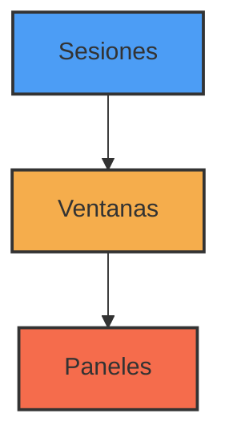
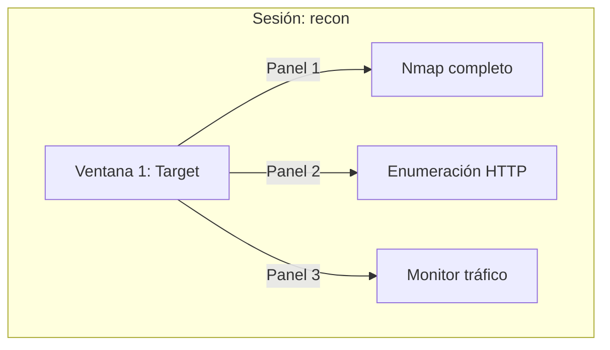

# 🔄 TMUX: Terminal MUltipleXer

> [!info] ¿Qué es TMUX?
> **Tmux** es un **multiplexor de terminal** que permite ejecutar y gestionar múltiples sesiones de terminal dentro de una sola ventana. Facilita el trabajo con varias tareas simultáneas, mantener sesiones activas aunque te desconectes, y organizar tu flujo de trabajo de pentesting.

## 🎯 Propósito y utilidad en ciberseguridad

> [!tip] Casos de uso en hacking/pentesting
> - Mantener procesos de escaneo (Nmap, dirbusting) mientras trabajas en otras tareas
> - Preservar sesiones remotas en servidores comprometidos aunque pierdas conexión
> - Organizar múltiples shells en una máquina víctima
> - Documentar hallazgos mientras ejecutas herramientas simultáneamente

---

## 📋 Conceptos básicos de TMUX

Tmux organiza su estructura en tres niveles jerárquicos:



- **Sesión**: Entorno independiente con su propio conjunto de ventanas
- **Ventana**: Similar a una pestaña en un navegador
- **Panel**: Divisiones dentro de una ventana (splits)

> [!warning] Tecla de prefijo
> La mayoría de comandos en tmux requieren primero pulsar el prefijo (por defecto `Ctrl+b`). En esta guía se asume que ese es tu prefijo.

---

## 🔰 Primeros pasos con TMUX

### Instalación

```bash
# Debian/Ubuntu/Kali
sudo apt install tmux

# Arch
sudo pacman -S tmux

# macOS
brew install tmux
```

### Comandos esenciales

| Acción | Comando | Descripción |
|--------|---------|-------------|
| Iniciar tmux | `tmux` | Crea e inicia una nueva sesión |
| Iniciar con nombre | `tmux new -s hacksession` | Crea sesión con nombre específico |
| Listar sesiones | `tmux ls` | Muestra todas las sesiones activas |
| Conectarse a sesión | `tmux attach -t hacksession` | Conecta a una sesión existente |
| Desconectarse | `Prefijo + d` | Desconecta de la sesión actual (detach) |
| Matar sesión | `tmux kill-session -t hacksession` | Elimina una sesión específica |

> [!example] Flujo básico
> 1. Crea sesión: `tmux new -s enum`
> 2. Ejecuta comandos, organiza ventanas/paneles
> 3. Desconecta con `Ctrl+b d` sin interrumpir procesos
> 4. Reconecta más tarde: `tmux attach -t enum`

---

## 🪟 Gestión de ventanas y paneles

### Manejo de paneles (splits)

> [!note] Paneles
> Los paneles permiten dividir una ventana en múltiples secciones, ideal para monitorear varias herramientas simultáneamente.

```bash
# Después de presionar el prefijo (Ctrl+b):
% # Divide el panel verticalmente (izquierda/derecha)
" # Divide el panel horizontalmente (arriba/abajo)
```

| Acción | Atajo | Descripción |
|--------|-------|-------------|
| División vertical | `Prefijo + %` | Crea panel a la derecha |
| División horizontal | `Prefijo + "` | Crea panel abajo |
| Navegar entre paneles | `Prefijo + ←↑→↓` | Moverse con flechas |
| Cerrar panel | `exit` o `Ctrl+d` | Cierra el panel actual |
| Redimensionar panel | `Prefijo + Ctrl+←↑→↓` | Ajustar tamaño |
| Maximizar/restaurar panel | `Prefijo + z` | Enfoca un panel |
| Ver diseños predefinidos | `Prefijo + Space` | Cicla entre layouts |

### Gestión de ventanas

> [!note] Ventanas
> Similar a pestañas en un navegador, útil para separar contextos de trabajo (reconocimiento, explotación, post-explotación).

| Acción | Atajo | Descripción |
|--------|-------|-------------|
| Nueva ventana | `Prefijo + c` | Crea ventana nueva |
| Cambiar entre ventanas | `Prefijo + n/p` | Siguiente/anterior |
| Ir a ventana específica | `Prefijo + 0-9` | Salto directo por número |
| Renombrar ventana | `Prefijo + ,` | Cambiar nombre |
| Listar ventanas | `Prefijo + w` | Muestra todas las ventanas |
| Buscar ventana | `Prefijo + f` | Busca por contenido |

---

## 💻 Ejemplos prácticos para hacking

### Ejemplo 1: Múltiples escaneos en una máquina objetivo



**Paso a paso:**

```bash
# Crear una sesión para reconocimiento
tmux new -s recon

# Dividir la ventana para diferentes escaneos
# Presiona Ctrl+b " para dividir horizontalmente
# Presiona Ctrl+b % para dividir verticalmente

# En el panel 1: Escaneo completo
nmap -sC -sV -p- -oA full_scan 10.10.10.10 --open

# Moverse al panel 2 (Ctrl+b ↓) y ejecutar:
gobuster dir -u http://10.10.10.10 -w /usr/share/wordlists/dirb/common.txt -o directories.txt

# Moverse al panel 3 (Ctrl+b →) y ejecutar:
tcpdump -i tun0 host 10.10.10.10
```

> [!tip] Ventaja
> Puedes desconectarte (`Ctrl+b d`) y los escaneos seguirán ejecutándose en segundo plano. Luego puedes volver a conectarte con `tmux attach -t recon`.

### Ejemplo 2: Organizando un CTF o ejercicio de penetración

```bash
# Crear sesión multipropósito para pentesting
tmux new -s pentest

# Crear ventanas temáticas (después de cada comando, presiona Ctrl+b c)
# Ventana 1: Reconocimiento
nmap -sS 10.10.10.0/24

# Ventana 2: Explotación (Ctrl+b c para crear nueva ventana)
# Dividir en paneles para listener y exploit
# Ctrl+b % para dividir verticalmente
# Panel izquierdo:
msfconsole -q
# Configuras tu exploit...

# Panel derecho (Ctrl+b →): 
nc -lvnp 4444

# Ventana 3 (Ctrl+b c): Documentación
mkdir -p ~/pentest/target_X
cd ~/pentest/target_X
nano notas.md
# Aquí documentas hallazgos mientras trabajas
```

---

## 🛠️ Configuración y personalización

### Archivo de configuración

Tmux se configura mediante el archivo `~/.tmux.conf`:

```bash
# Ejemplo de archivo tmux.conf para pentesting

# Cambiar prefijo a Ctrl+a (más accesible que Ctrl+b)
unbind C-b
set -g prefix C-a
bind C-a send-prefix

# Mejor soporte de colores para herramientas
set -g default-terminal "screen-256color"

# División de paneles más intuitiva
bind | split-window -h
bind - split-window -v
unbind '"'
unbind %

# Recarga rápida de configuración
bind r source-file ~/.tmux.conf \; display "Configuración recargada!"

# Historial más grande para análisis
set -g history-limit 50000

# Modo vi para navegación (útil para copiar logs)
setw -g mode-keys vi

# Sincronización de paneles (útil para comandos idénticos en múltiples hosts)
bind S setw synchronize-panes

# Mostrar actividad en otras ventanas
setw -g monitor-activity on
set -g visual-activity on
```

Para aplicar cambios:
```bash
# Desde fuera de tmux
tmux source-file ~/.tmux.conf

# O desde dentro de tmux
Prefijo + : 
source-file ~/.tmux.conf
```

---

## 🧩 Funciones avanzadas para pentesting

### Copiar y pegar

> [!example] Uso en pentesting
> Ideal para guardar resultados, hashes, contraseñas o comandos entre diferentes paneles

1. Entrar en modo copia: `Prefijo + [`
2. Navegar con teclas o flechas
3. Iniciar selección: `Space`
4. Copiar selección: `Enter`
5. Pegar: `Prefijo + ]`

### Sincronización de paneles

Útil para ejecutar comandos idénticos en múltiples máquinas comprometidas:

```bash
# Activar sincronización
Prefijo + :
setw synchronize-panes on

# Desactivar
Prefijo + :
setw synchronize-panes off
```

> [!tip] Caso de uso
> Cuando tienes shell en varios sistemas similares y necesitas ejecutar los mismos comandos de elevación de privilegios o exfiltración.

### Scripts de automatización

Crea un archivo `pentest-setup.sh` para configurar tu entorno automáticamente:

```bash
#!/bin/bash
# Script para iniciar entorno de pentesting con tmux

# Crear sesión con ventanas predefinidas
tmux new-session -d -s pentest -n 'recon'

# Configurar ventana de reconocimiento
tmux send-keys -t pentest:recon 'cd ~/engagements/target' C-m
tmux send-keys -t pentest:recon 'clear' C-m

# Dividir para múltiples herramientas
tmux split-window -h -t pentest:recon
tmux split-window -v -t pentest:recon.1

# Ventana de exploit
tmux new-window -t pentest -n 'exploit'
tmux send-keys -t pentest:exploit 'msfconsole -q' C-m

# Ventana para pivot/post-explotación
tmux new-window -t pentest -n 'post'

# Ventana para notas
tmux new-window -t pentest -n 'notas'
tmux send-keys -t pentest:notas 'cd ~/engagements/target/docs && vim notas.md' C-m

# Volver a la primera ventana
tmux select-window -t pentest:recon

# Conectar a la sesión
tmux attach-session -t pentest
```

Para ejecutar:
```bash
chmod +x pentest-setup.sh
./pentest-setup.sh
```

---

## 📝 Consejos y mejores prácticas

> [!tip] Tips para optimizar tmux en pentesting
> 
> - **Nombra tus sesiones** según el objetivo (`client-X`, `machine-Y`) para organizar mejor
> - **Usa ventanas temáticas**: reconocimiento, explotación, persistencia, documentación
> - **Script de inicio**: Automatiza la creación de tu entorno para cada pentest
> - **Guarda logs**: `tmux capture-pane -p -S - > output.log` para registrar resultados
> - **Añade indicadores visuales**: Para saber en qué máquina/contexto estás trabajando

### Errores comunes y soluciones

> [!warning] Problemas habituales
>
> - **No se puede crear una sesión**: Verifica si ya existe con `tmux ls`
> - **Problemas de permisos**: `chmod 700 ~/.tmux.conf` para solucionar
> - **Colores incorrectos**: Añade `set -g default-terminal "screen-256color"` a tu configuración
> - **"Cannot open clipboard"**: Instala xclip (`apt install xclip`)

---

## 🔗 Recursos adicionales

- [Cheat Sheet oficial de Tmux](https://tmuxcheatsheet.com/)
- [Tmux Plugin Manager](https://github.com/tmux-plugins/tpm) para extender funcionalidades
- [Oh My Tmux](https://github.com/gpakosz/.tmux) para una configuración preoptimizada

> [!note] Relacionado
> [[terminal-basics]] | [[linux-tools]] | [[pentesting-workflow]]