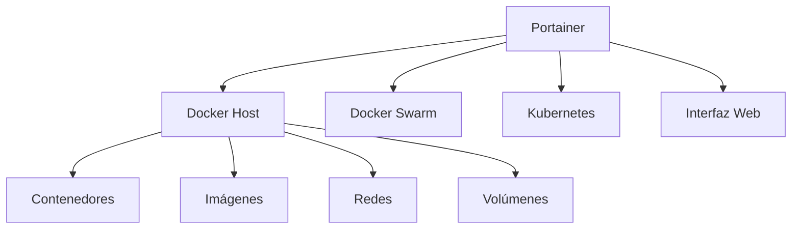

# 🐳 Portainer (Docker)

---

## 📝 Definición

> [!info]  
> **Portainer** es una plataforma de gestión visual y simplificada para entornos de contenedores, principalmente **Docker** y **Docker Swarm**. Permite administrar, monitorizar y orquestar contenedores, imágenes, volúmenes y redes a través de una interfaz web intuitiva.

---

## 🧩 Características Principales

- **Interfaz gráfica web** para gestionar recursos Docker.
- Soporte para **Docker Standalone**, **Docker Swarm** y **Kubernetes**.
- Gestión de:
    - Contenedores (crear, iniciar, detener, eliminar)
    - Imágenes (descargar, eliminar, construir)
    - Volúmenes y redes
    - Stacks y servicios en Swarm
- **Control de acceso basado en roles** (RBAC) en la versión Business.
- **Monitorización básica** de recursos y logs.
- **Despliegue sencillo**: se ejecuta como un contenedor Docker.

---

## 🛠️ Instalación y Uso Básico

### Instalación rápida (Docker Standalone)

```bash
docker volume create portainer_data

docker run -d \
  -p 9443:9443 \
  -p 9000:9000 \
  --name=portainer \
  --restart=always \
  -v /var/run/docker.sock:/var/run/docker.sock \
  -v portainer_data:/data \
  portainer/portainer-ce:latest
```

- Acceso web:  
  - http://localhost:9000 (HTTP)  
  - https://localhost:9443 (HTTPS)

### Parámetros comunes

| Parámetro Docker | Descripción |
|------------------|-------------|
| `-v /var/run/docker.sock:/var/run/docker.sock` | Permite a Portainer controlar el Docker host |
| `-v portainer_data:/data` | Persiste la configuración y datos de Portainer |
| `-p 9000:9000` | Expone el puerto web HTTP |
| `-p 9443:9443` | Expone el puerto web HTTPS |
| `--restart=always` | Reinicia Portainer automáticamente si falla |

---

## 📊 Comparativa: Portainer vs. CLI Docker

| Característica         | Portainer (Web) | Docker CLI |
|-----------------------|:---------------:|:----------:|
| Facilidad de uso      | ⭐⭐⭐⭐⭐           | ⭐⭐         |
| Visualización         | ⭐⭐⭐⭐⭐           | ⭐          |
| Automatización        | ⭐⭐              | ⭐⭐⭐⭐⭐      |
| Control avanzado      | ⭐⭐⭐             | ⭐⭐⭐⭐⭐      |
| Multi-host/Swarm      | ⭐⭐⭐⭐            | ⭐⭐⭐        |
| Seguridad (RBAC)      | ⭐⭐⭐⭐ (Business) | ⭐⭐         |

---

## 🌐 Contextos de Uso

- **DevOps**: Gestión visual de entornos de desarrollo y producción.
- **Pentesting y laboratorios**: Rápida creación y destrucción de entornos de prueba.
- **Educación**: Enseñanza de conceptos de contenedores de forma visual.
- **Administración de sistemas**: Monitorización y troubleshooting de contenedores.

---

## 🧠 Ejemplo de Uso

1. **Desplegar Portainer** como contenedor Docker.
2. Acceder a la interfaz web y crear un usuario administrador.
3. Conectar Portainer al Docker host local o remoto.
4. Gestionar contenedores, imágenes y redes desde la interfaz gráfica.
5. Visualizar logs, estadísticas y realizar operaciones de mantenimiento.

---

## 🛡️ Ventajas y Limitaciones

| Ventajas                                 | Limitaciones                        |
|------------------------------------------|-------------------------------------|
| Fácil de instalar y usar                 | Algunas funciones avanzadas solo en versión Business |
| Interfaz intuitiva y visual              | Puede ser un objetivo de ataque si se expone sin protección |
| Multi-plataforma (Docker, Swarm, K8s)    | No reemplaza herramientas de orquestación complejas |
| Permite gestión remota                   | Requiere acceso al Docker socket (riesgo si no se restringe) |

---

## 🔗 Recursos y Conceptos Relacionados

- [[Docker]]
- [[Docker Swarm]]
- [[Kubernetes]]
- [[Orquestación de Contenedores]]
- [Documentación oficial de Portainer](https://docs.portainer.io/)

---

## 🧭 Resumen Visual



---

> [!summary]
> **Portainer** es una solución visual y eficiente para la gestión de contenedores Docker, ideal para quienes buscan simplicidad, control y visibilidad sin depender exclusivamente de la línea de comandos.